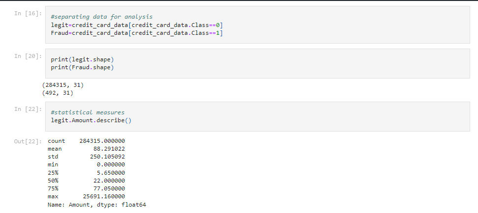

# Credit Card Fraud Detection
# Overview:
This project focuses on detecting fraudulent credit card transactions using machine learning techniques. With the rise in online transactions, identifying fraudulent activities has become increasingly important. This project aims to mitigate financial losses by building a robust predictive model to identify potentially fraudulent transactions.**

**It contains only numerical input variables which are the result of a PCA transformation. Unfortunately, due to confidentiality issues, we cannot provide the original features and more background information about the data. Features V1, V2, … V28 are the principal components obtained with PCA, the only features which have not been transformed with PCA are 'Time' and 'Amount'. Feature 'Time' contains the seconds elapsed between each transaction and the first transaction in the dataset. The feature 'Amount' is the transaction Amount, this feature can be used for example-dependant cost-sensitive learning. Feature 'Class' is the response variable and it takes value 1 in case of fraud and 0 otherwise.**\
# Features:
Data Collection: Gathering a comprehensive dataset containing credit card transactions, including both legitimate and fraudulent instances, to train and evaluate the model. \
Data Preprocessing: Cleaning and preprocessing the dataset, handling imbalanced data, and scaling features to prepare the data for model development. \
Exploratory Data Analysis (EDA): Conducting exploratory analysis and visualization to understand patterns, trends, and anomalies within the transaction data. \
Model Development: Employing various machine learning algorithms such as Logistic Regression, Random Forest, or Gradient Boosting to create a predictive model capable of distinguishing between genuine and fraudulent transactions.
# Technologies Used:
Programming Languages: Python
Libraries: Pandas, NumPy, Scikit-learn
Machine Learning Techniques: Supervised Learning, Imbalanced Data Handling, Model Evaluation

Kaggle Dataset:https://www.kaggle.com/datasets/mlg-ulb/creditcardfraud

